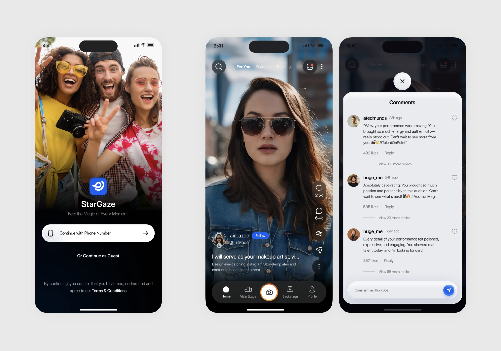
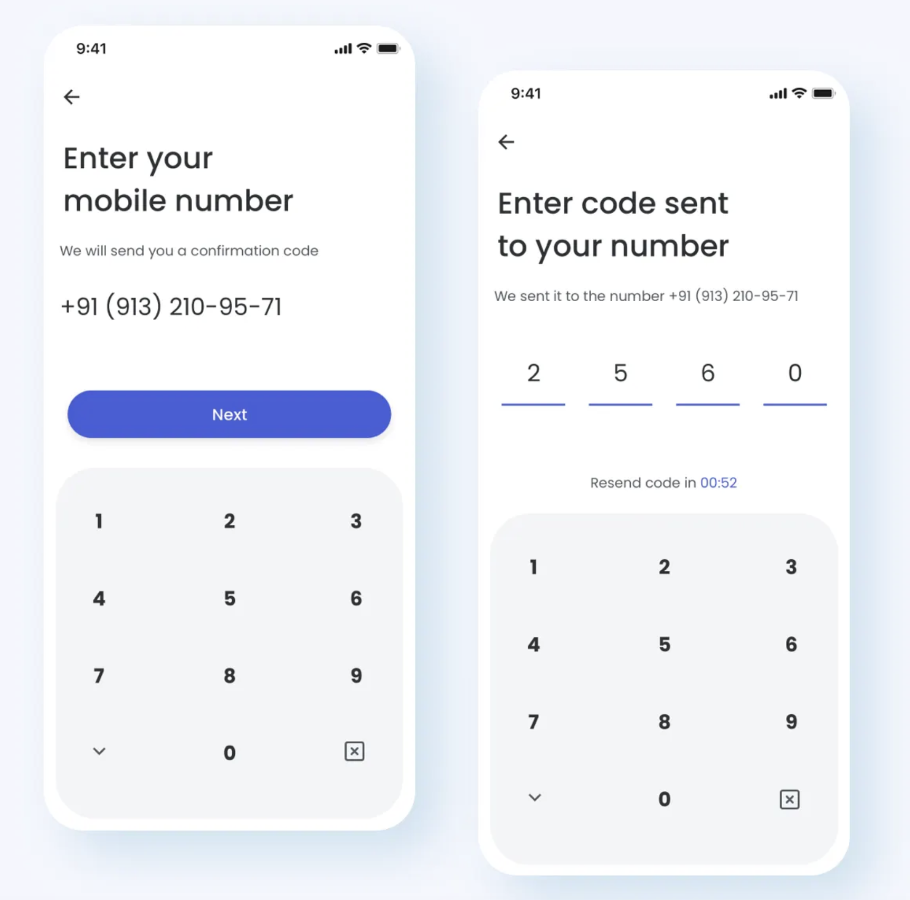
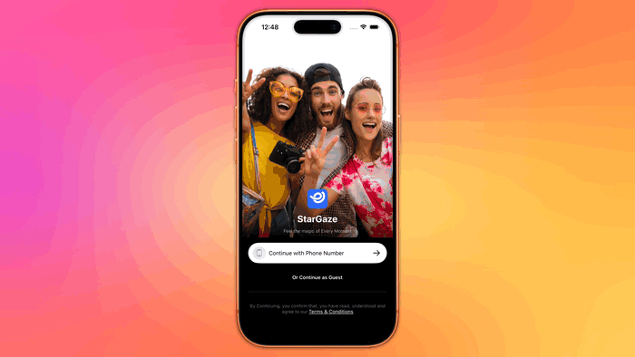

# fandomsocial

A modern, cross-platform social media application inspired by [Dribbble](https://dribbble.com), showcasing design-forward UI/UX and full-stack mobile development capabilities. This project demonstrates expertise in native iOS (SwiftUI), native Android (Kotlin/Jetpack Compose), and React Native development.

## 🎯 Project Vision

**fandomsocial** is a social media platform that combines beautiful design aesthetics with seamless user experiences across all major mobile platforms. Inspired by Dribbble's design-first approach, the app emphasizes:

- **Visual Excellence**: Pixel-perfect UI implementations with smooth animations
- **Cross-Platform Consistency**: Unified user experience across iOS, Android, and React Native
- **Modern Architecture**: Clean, scalable codebases following platform best practices
- **Performance**: Optimized for speed and responsiveness

## 🎯 Design Inspiration



## 📱 Final output


## 📱 Platform Implementations

This repository contains three complete implementations of the same application:

### 🍎 iOS (SwiftUI)
- **Location**: `IOS/`
- **Framework**: SwiftUI with iOS 17+
- **Architecture**: MVVM with custom navigation router
- **Status**: ✅ In Progress
- **Key Features**:
  - Custom navigation system with `NavigationRouter`
  - Custom numeric keypad and OTP input components
  - Smooth animations and transitions
  - Dark mode support

## 🏗️ Project Structure

```
fandomsocial/
├── IOS/                          # iOS SwiftUI implementation
│   ├── fandomsocial/
│   │   ├── components/           # Reusable SwiftUI components
│   │   ├── landing/              # Landing screen views
│   │   ├── mobileNumber/         # Phone auth screens
│   │   ├── home/                 # Home screen
│   │   ├── navigation/           # Custom navigation system
│   │   ├── theme/                # App theming
│   │   └── logger/               # Logging utilities
│   └── fandomsocial.xcodeproj/
│
└── README.md                     # This file
```

## ✨ Features

### Core Features (Planned)
- 🔐 **Authentication**: Phone number OTP verification
- 👤 **User Profiles**: Customizable user profiles with avatars
- 📸 **Content Sharing**: Share photos, videos, and stories
- 💬 **Social Feed**: Personalized feed with likes, comments, and shares
- 🔍 **Discovery**: Explore trending content and users
- 📱 **Notifications**: Real-time push notifications
- ⚙️ **Settings**: User preferences and account management

### Design Features
- 🎨 **Custom UI Components**: Platform-native components with consistent design language
- 🌙 **Dark Mode**: Full dark mode support across all platforms
- ✨ **Animations**: Smooth, performant animations and transitions
- 📐 **Responsive Design**: Adapts to different screen sizes and orientations
- 🎯 **Accessibility**: WCAG-compliant accessibility features

## 🛠️ Tech Stack

### iOS
- **Language**: Swift 5.9+
- **UI Framework**: SwiftUI
- **Architecture**: MVVM
- **Navigation**: Custom NavigationRouter with NavigationStack
- **Minimum iOS**: iOS 17.0+
- **IDE**: Xcode 15+

## 🚀 Getting Started

### Prerequisites
- **iOS Development**: Xcode 15+ with iOS 17+ Simulator
- **Android Development**: Android Studio with Android SDK 24+
- **React Native Development**: Node.js 18+, React Native CLI

### iOS Setup

1. Navigate to the iOS directory:
   ```bash
   cd IOS
   ```

2. Open the project in Xcode:
   ```bash
   open fandomsocial.xcodeproj
   ```

3. Select a simulator or device and run (⌘R)

4. See `IOS/README.md` for detailed iOS-specific documentation

### Android Setup (Coming Soon)

```bash
cd Android
./gradlew build
```

### React Native Setup (Coming Soon)

```bash
cd ReactNative
npm install
npm run android  # or npm run ios
```

## 📋 Development Roadmap

### Phase 1: Foundation ✅ (In Progress)
- [x] iOS project setup with SwiftUI
- [x] Custom navigation system
- [x] Landing screen with authentication flow
- [x] Phone number OTP verification UI
- [ ] Backend API integration
- [ ] User authentication logic

### Phase 2: Core Features 🚧
- [ ] Home feed implementation
- [ ] User profile screens
- [ ] Content creation and sharing
- [ ] Social interactions (like, comment, share)
- [ ] Android implementation
- [ ] React Native implementation

### Phase 3: Advanced Features 📅
- [ ] Real-time notifications
- [ ] Search and discovery
- [ ] Stories feature
- [ ] Direct messaging
- [ ] Analytics and performance monitoring

### Phase 4: Polish & Optimization 🎯
- [ ] Performance optimization
- [ ] Comprehensive testing (Unit, Integration, E2E)
- [ ] Accessibility improvements
- [ ] Internationalization (i18n)
- [ ] App Store / Play Store preparation

## 🎨 Design Inspiration

This project draws inspiration from [Dribbble](https://dribbble.com), focusing on:
- Clean, modern interfaces
- Thoughtful micro-interactions
- Consistent design systems
- User-centric experiences

## 🤝 Contributing

This is a portfolio project showcasing full-stack mobile development capabilities. Contributions, suggestions, and feedback are welcome!

## 📄 License

This project is created for portfolio and educational purposes.

## 👨‍💻 Developer

**Debdut Saha**
- Full-Stack Mobile Developer
- Specializing in iOS (SwiftUI), Android (Kotlin/Jetpack Compose), and React Native

## 📞 Contact

For questions, collaborations, or opportunities, feel free to reach out!

---

**Note**: This project is actively under development. Some features and platforms are still in progress. Check individual platform READMEs for current status and detailed documentation.
